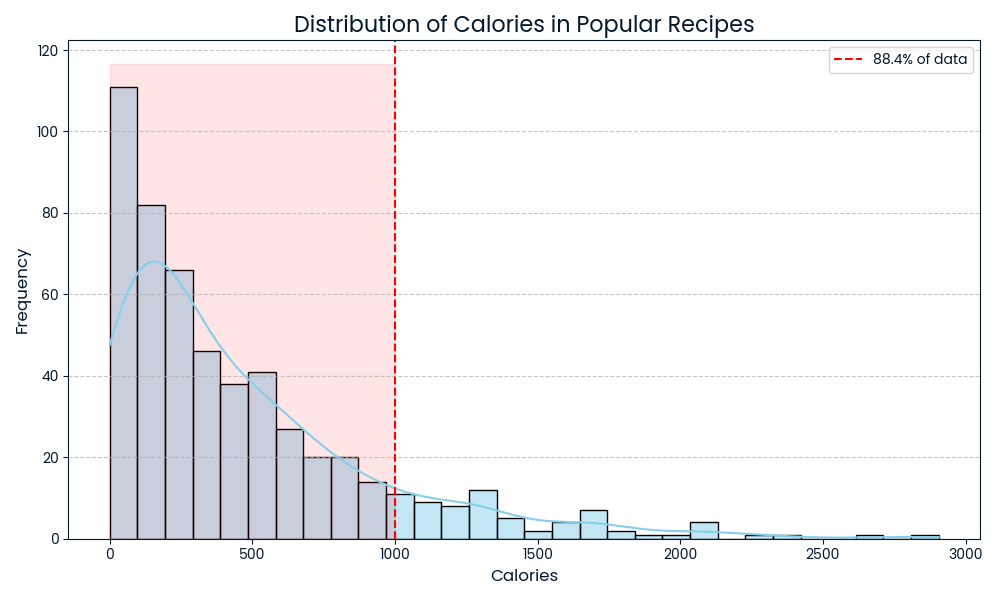
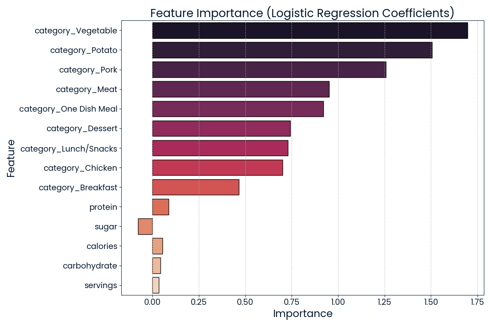

# Predicting Recipe Popularity

## 📌 Project Overview
This project is part of the **Data Scientist Professional Practical Exam Submission**, where the goal is to **predict which recipes will be popular 80% of the time and minimize the chance of showing unpopular recipes**.

To achieve this, I developed and compared two classification models:
- **Logistic Regression** (chosen model)
- **Random Forest Classifier** (comparison model)

The final model helps **Tasty Bytes**, a recipe recommendation platform, optimize its recipe selection and improve user engagement.

---

## 📊 Dataset Overview
The dataset consists of **895 recipes** after cleaning, with the following features:

| Column Name   | Type       | Description |
|--------------|-----------|-------------|
| `recipe`     | Numeric   | Unique identifier for each recipe |
| `calories`   | Numeric   | Number of calories per serving |
| `carbohydrate` | Numeric | Amount of carbohydrates (grams) |
| `sugar`      | Numeric   | Amount of sugar (grams) |
| `protein`    | Numeric   | Amount of protein (grams) |
| `category`   | Categorical | Recipe category (e.g., ‘Lunch/Snacks’, ‘Dessert’) |
| `servings`   | Numeric   | Number of servings per recipe |
| `high_traffic` | Binary  | Whether the recipe had high website traffic (`1` = High, `0` = Low) |

---

## 🔍 Data Preprocessing
- **Handled missing values**: Dropped missing nutritional values (5.49% of data)
- **Categorical Encoding**: One-hot encoding applied to `category`
- **Numerical Scaling**: Standardized numerical columns (`calories`, `carbohydrate`, `sugar`, `protein`)
- **Binary Encoding**: Converted `high_traffic` into `0` (low traffic) and `1` (high traffic)

---

## 📈 Exploratory Data Analysis (EDA)
Key insights from data exploration:
- **88.04%** of high-traffic recipes contain fewer than **1000 calories**
- The **Vegetable, Potato, and Pork** categories show the highest traffic
- **Sugar has a negative correlation** with recipe popularity, suggesting a preference for low-sugar recipes



---

## 🤖 Model Selection & Evaluation
### ✅ **Chosen Model: Logistic Regression**
- **Precision:** `83%` (higher precision reduces false positives)
- **Recall:** `79%`
- **F1-Score:** `81%`
- **ROC-AUC:** `83%`
- **Optimized Threshold:** `0.455`

### 🔄 **Comparison Model: Random Forest**
- **Precision:** `81%`
- **Recall:** `76%`
- **F1-Score:** `78%`
- **ROC-AUC:** `80%`

📌 **Why Logistic Regression?**
- Higher precision than Random Forest, ensuring more accurate recommendations
- Computationally efficient and easy to interpret
- Clear feature importance insights for business decisions

---

## 🏆 Feature Importance
Top predictors for recipe popularity:
1. **Category** (e.g., `Vegetable`, `Potato`, `Pork`) - Strongest predictors
2. **Protein** - Positive correlation with popularity
3. **Sugar** - Slight negative impact on popularity



---

## 📌 Business Recommendations
1. **Prioritize High-Traffic Categories**: Focus on recipes in the `Vegetable`, `Potato`, and `Pork` categories.
2. **Reduce Sugar in Recipes**: Since sugar negatively affects popularity, optimize ingredient choices.
3. **Enhance Marketing for Low-Traffic Categories**: Consider rebranding or modifying underperforming recipes.
4. **Introduce Customer Engagement Metrics**:
   - Track **recipe saves**, **revisit rates**, and **premium user preferences**.
   - Integrate these features into future model versions for improved accuracy.

---

## 🚀 Next Steps
- **Refine model using additional features** (e.g., ingredient cost, seasonal trends)
- **Test with different classification models** (e.g., XGBoost, SVM)
- **Implement an A/B test** to validate model predictions in a real-world scenario

---

## 🛠️ How to Run the Code
1. Clone the repository:
   ```bash
   git clone https://github.com/Diegortiz43/Data_Scientist_Certification.git
   cd Data_Scientist_Certification
